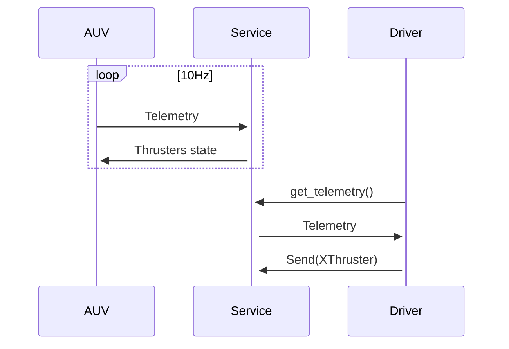

# MSUR Packages
Suite libraries for auv of msu-robotics team

## CRC16
Calculates special crc16, for checking telemetry packages

## Driver
Implementation for communication protocol of auv

### sequence diagram

# Installation
For install libraries use following command:
```
pip install msur-packages
```
For working `driver` needs install communication service